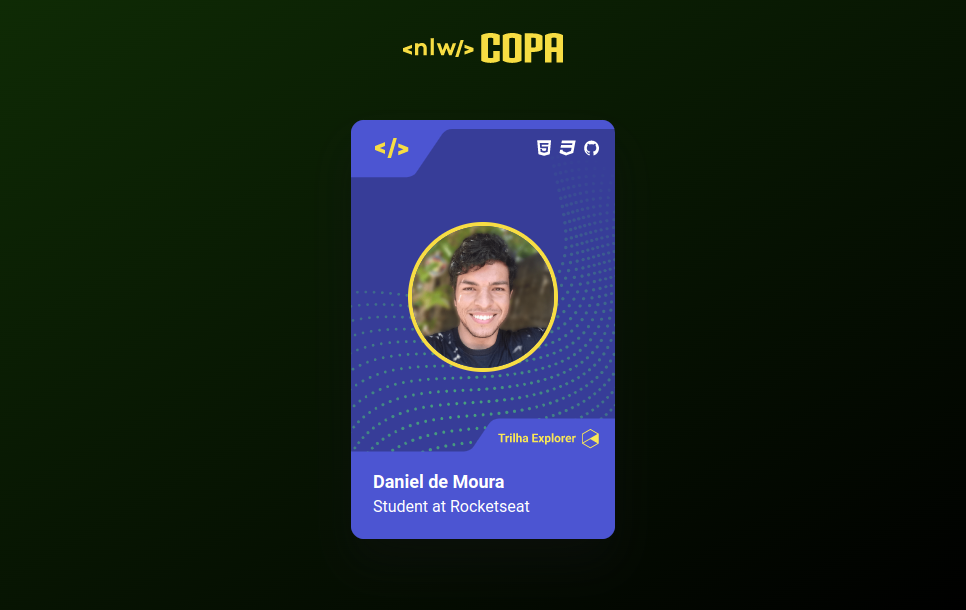

<h1 align="center"> Card NLW Copa </h1>

  <a href="#-tecnologias">Tecnologias</a>&nbsp;&nbsp;&nbsp;|&nbsp;&nbsp;&nbsp;
  <a href="#-layout">Layout</a>&nbsp;&nbsp;&nbsp;

 

  

## 🚀 Tecnologias

Esse projeto foi desenvolvido com as seguintes tecnologias:

- HTML
- CSS
- JavaScript

## 🔖 Layout

Você pode visualizar o layout do projeto através [DESSE LINK](https://www.figma.com/file/jPTyJr0TSpTfi4Yv2xfVJU/NLW-Copa-Card-(Copy)?node-id=4%3A11). É necessário ter conta no [Figma](https://figma.com) para acessá-lo.

---

